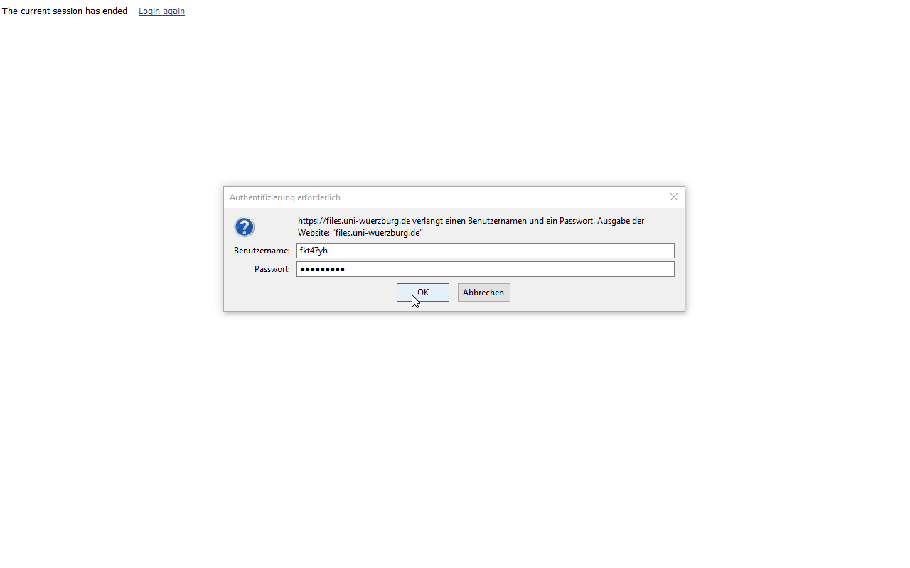
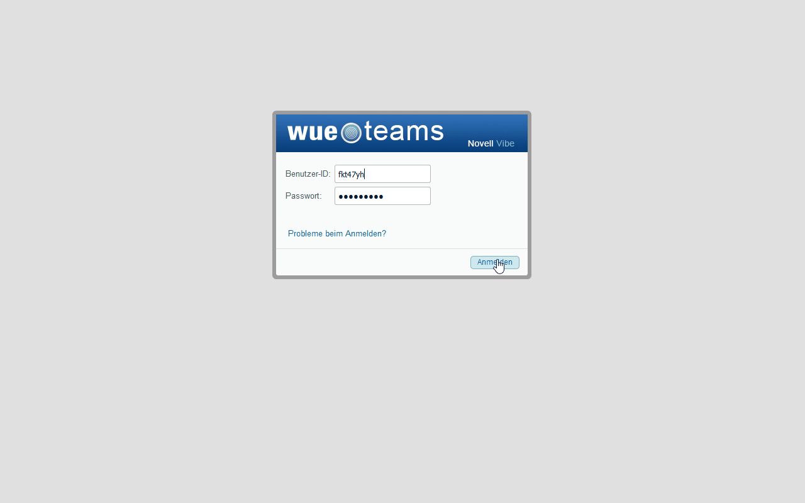

# Empra-Account

empra.grossekathoefer@uni-wuerzburg.de

Zugangsdaten per Mail erhalten

## Netzlaufwerk

[files.uni-wuerzburg.de](files.uni-wuerzburg.de): Zum Teilen von Dateien untereinander.

+   Bei fehlendem Speicherplatz bitte Bescheid geben

über: [Files - webbasierter Zugriff auf Netzlaufwerke (RZ)](https://www.rz.uni-wuerzburg.de/dienste/arbeitsplaetze/netzlaufwerk/files/)

## Versuchspersonmanagement

[SONA](https://psywue.sona-systems.com): Zum Freischalten von Erhebungsterminen.

[Anleitung (Download)](lib-account/SONA-Systems_Einleitung-Hiwis.pptx)

## Laborplan

[WueTeams](https://wueteams.uni-wuerzburg.de): Zum Buchen der Laborräume.

über: [WueTeams: Zusammenarbeit im Team mit "Novell Vibe"](https://www.rz.uni-wuerzburg.de/dienste/zusammenarbeit/wueteams/)

## Email

[Webmail](https://webmail.uni-wuerzburg.de/login.php): Zum Kontakt mit Versuchspersonen.