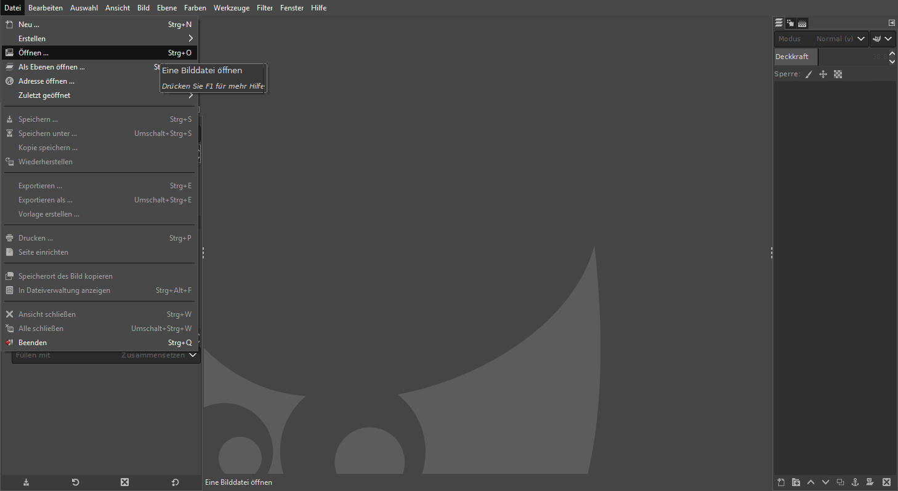
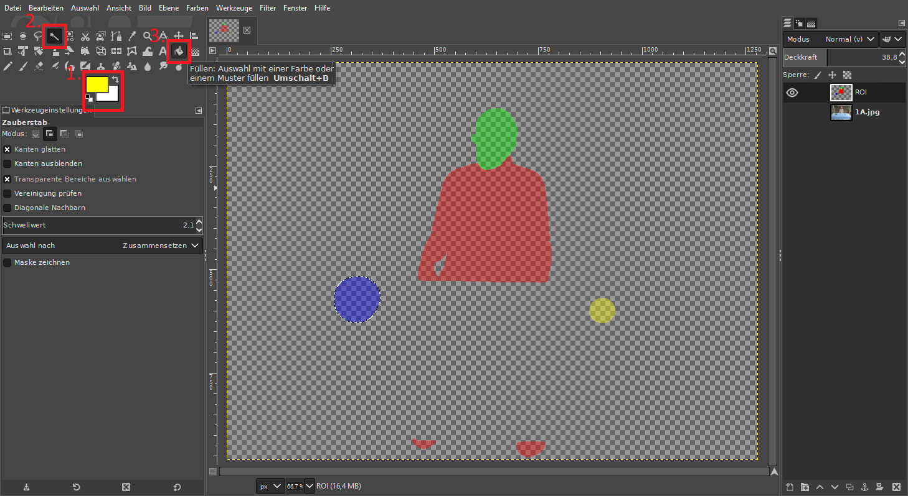
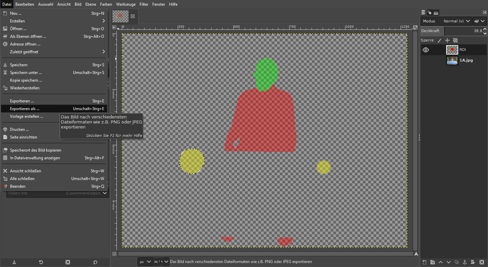
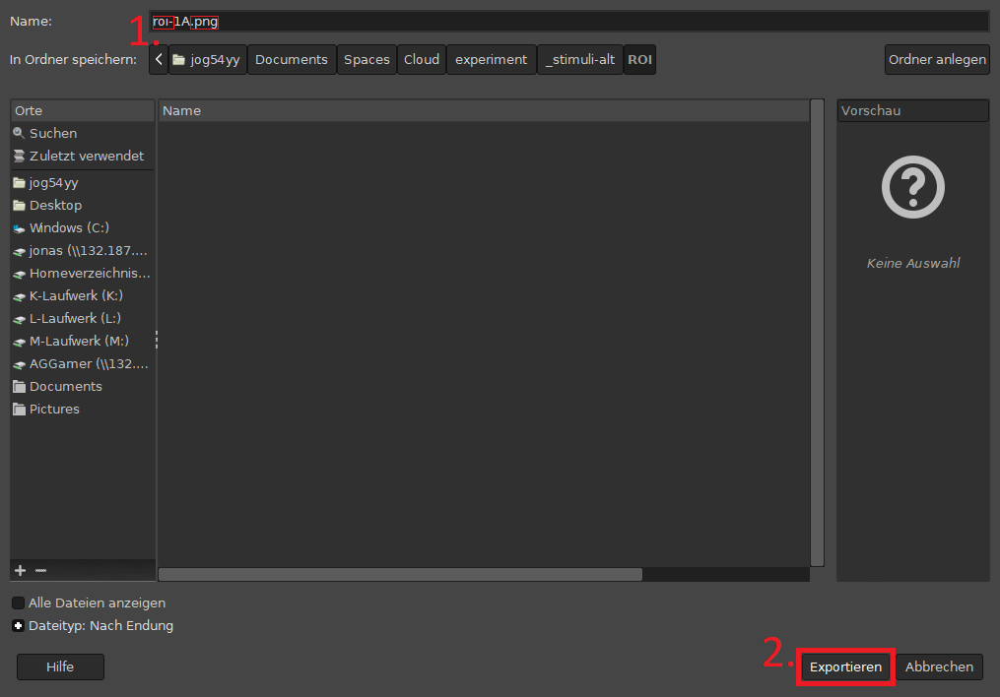
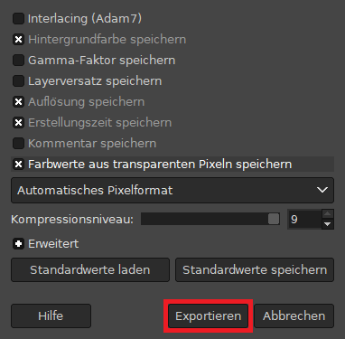

# Stimuli präparieren

## 1.  [Gimp](https://www.gimp.org/) (installieren &) öffnen

## 2. .xfc-Datei öffnen

## 3. Ebene (mit Foto) ausblenden

## 4. Stimulus bearbeiten

## 5. Exportieren

### Dateiname

**roi-**STIMULUS-ID**.png**

### 2. Exportieren

