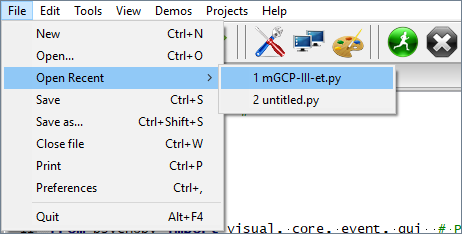
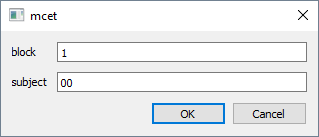
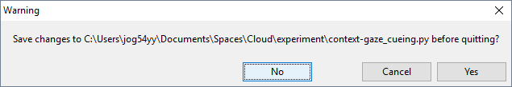

# Experiment durchführen

letzte Aktualisierung: 20.11.2018, 10:24

Anmerkung: Die Screenshots bestehen aus alten Bildern und können von der tatsächlichen Darstellung abweichen.

## Vorbereitung

### PCs hochfahren

+   alle drei Rechner hochfahren und mit den Account-Daten einloggen
    +   Benutzername: *bekannt*
    +   Passwort: *bekannt*

### PsychoPy starten

+   PsychoPy2 auf dem Desktop des Experiment-PC mit Doppelklick auf  öffnen  
+   Datei öffnen (falls noch nicht geöffnet)  

    +   über *Open recent* (s.o.)
    +   über *Open...* die Datei **gcc-run.py** öffnen
+   Datei mit Klick auf  ausführen

## Vor dem Experiment

### Experimentinformationen eintragen

+   Probandennummern bei *subject* eintragen  

+   Name des Versuchsleiters bei *experimenter* eintragen
+   Nummer des Rechners bei *computer* eintragen
    +   **entspricht der Anzahl der parallel getesteten Probanden(!)**
+   Mit *OK* Experiment starten  
+   Blanko Display erscheint auf dem Bildschirm
    

### Materialien vorbereiten

+   Fragebögen, Probandeninformation und Einverständiserklärung rauslegen
+   **ausschließlich** Fragebögen mit Probandennummer beschriften

## Proband begrüßen

+   Instruktion: „Hallo und herzlich Willkommen zu unserer Studie. Wir freuen uns, dass Sie sich zur Teilnahme bereit erklärt haben.“
+   „Untersuchung läuft“ Schild an die Türe hängen

### Probandeninformation und Einwilligungserklärung

+   Austeilen und unterschreiben lassen
    +   Ggfs. Fragen beantworten
+   Instruktion: „Bevor wir mit dem Experiment beginnen, teile ich Ihnen eine Probandeninformation aus, auf der Sie Informationen zum Ablauf der Studie finden. Ich bitte Sie, die Informationen aufmerksam durchzulesen und sich bei weiteren Fragen zu melden. Wenn Sie alles durchgelesen und verstanden haben, können Sie dies mit Ihrer Unterschrift auf der Einwilligungserklärung bestätigen.“
    +   Ggfs. Probandeninformation mündlich zusammenfassen
+   im Falle einer Nachfrage, weshalb die Adresse angegeben werden muss darauf hinweisen, dass aufgrund fehlender Probandennummer keine Zuordnung erfolgen kann und Anonymität garantiert ist.
+   Einwilligungserklärung in Ordner abheften
+   Probandennummer in die Probandenliste eintragen

## Experiment starten

+   Mit *Leertaste* auf der Experiment-Tastatur die Instruktionen aufrufen
  
+   Proband selbständig durch die Instruktion klicken lassen
    +   ggf. auf Rückfragen antworten

## Experiment beenden

+   Der experimentelle Teil endet automatisch
+   Zum Schluß Fragebögen ausfüllen lassen
+   Versuchsteilnahme bestätigen

## Nachbereitung

+   PsychoPy schließen
    +   Falls ein Dialog aufpoppt, ob die Datei gespeichert werden soll, auf **No** klicken  

+   PCs herunterfahren
