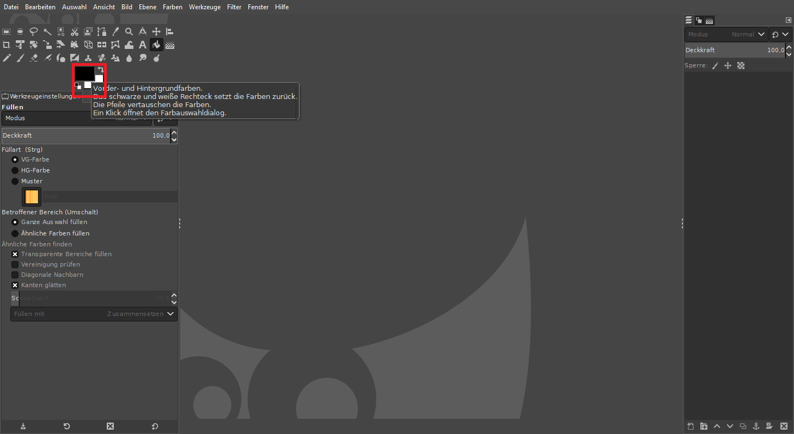
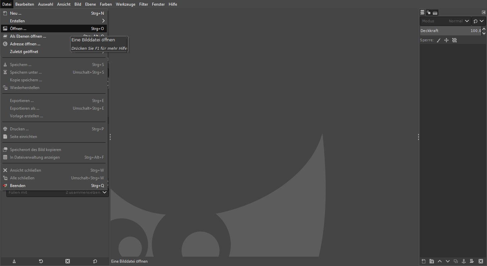
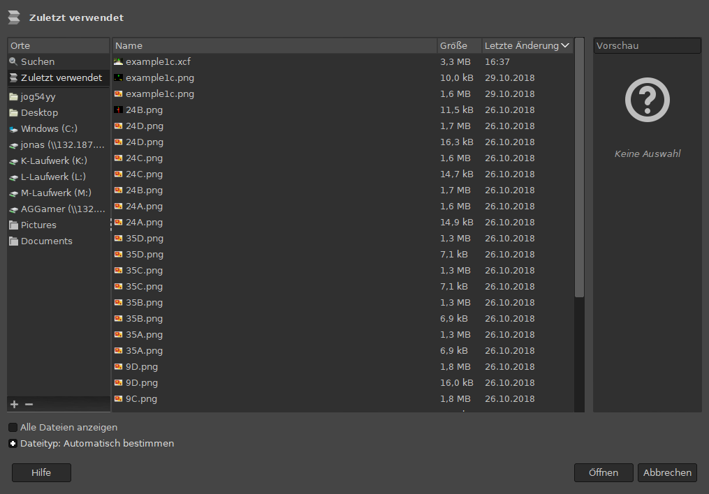
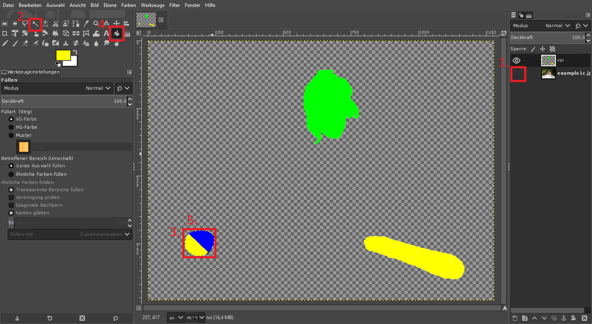
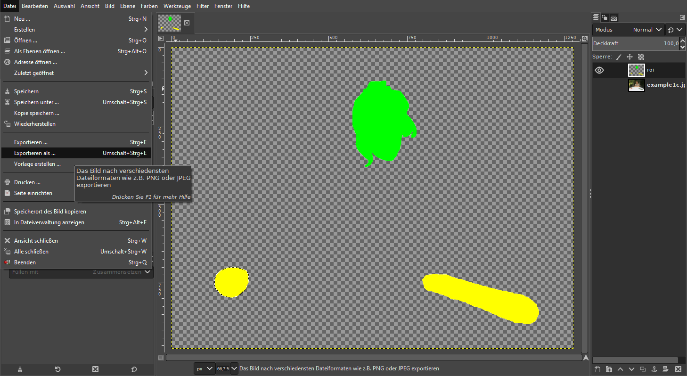
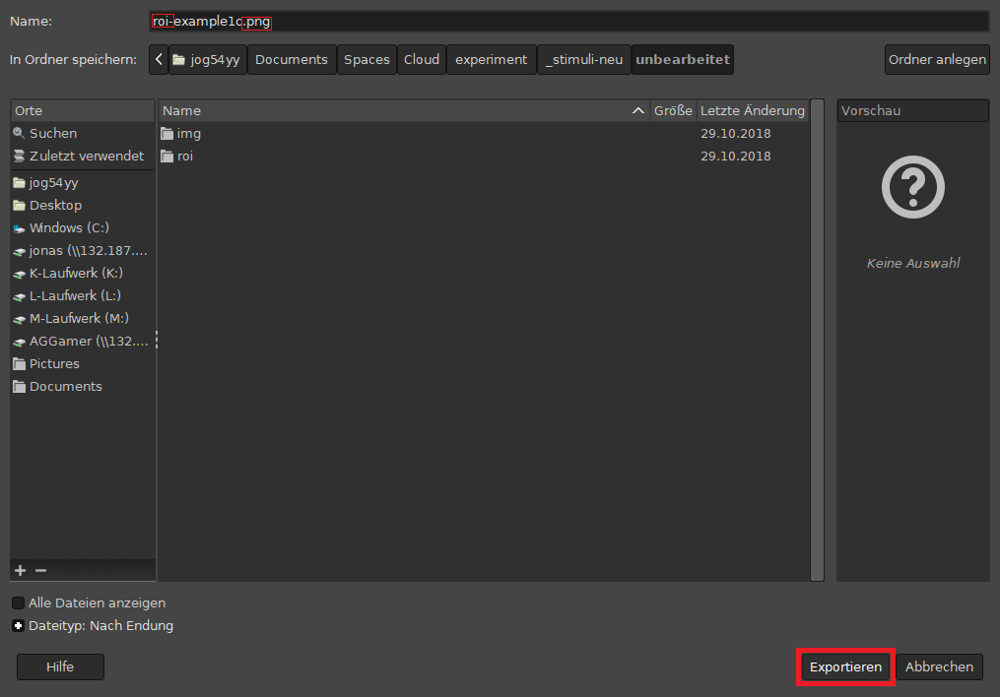
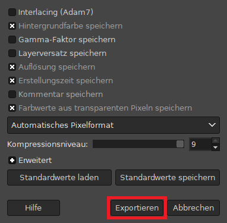
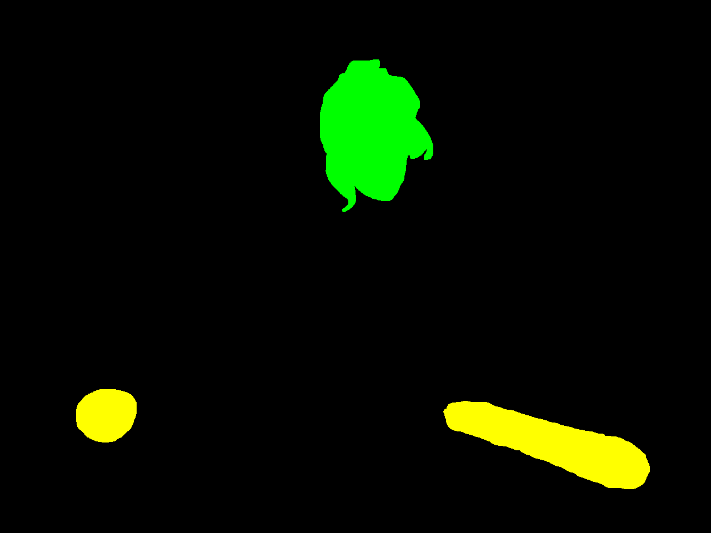

# Stimuli präparieren

Zur automatisierten Bearbeitung müssen die ROIs (Region-of-Interest) die gleichen Farben haben (Teil 1) und eine durchgängige Fläche ergeben (Teil2, folgt).

Anmerkung: Die Bilder können mit einem Klick vergrößert im Browser dargestellt werden.

Die .xfc-Dateien können [hier](https://1drv.ms/u/s!Aq2HAPGT8kWihuQjFKBsMVDyO7sqXA) runtergeladen werden. Der Zuggang und die Datei ist Passwort geschützt, die Passwörter habt ihr per Mail erhalten.

## Vorbereitung 

### [Gimp](https://www.gimp.org/) (installieren &) öffnen

### Farbe einstellen

1.  Auf *Vorder- und Hintergrundfarben* klicken
2.  In dem sich öffnenden Dialog die RGB-Werte eintragen
    +   R: **255**
    +   G: **255**
    +   B: **0**
3.  Mit *OK* den Dialog schließen

Diese Einstellung sollte erhalten bleiben, egal wie viele Dateien in Folge geöffnet werden, ggf. sogar beim Programmneustart.

## Workflow (Teil 1)

### Stimulus öffnen

+   Über *Datei* auf *Öffnen...* klicken, und

+   .xfc-Datei des zu bearbeitenden Stimulus' auswählen

### Stimulus präparieren

#### Präparation in max. 5 Klicks

1.  Ebene ausblenden
2.  Zauberstab auswählen (Tastenkombination: **U**)
3.  Blaues Objekt (hier zur Anschauung gelb\blau daragestellt) durch Anklicken markieren
4.  Eimer auswählen (Tastenkombination: **Shift** + **B**)
    +   sicher stellen, dass die Farbe korrekt eingestellt ist
5.  Markierte Fläche durch Anklicken einfärben

### Stimulus exportieren

+   Über *Datei* auf *Exportieren als...* klicken

+   den Dateinamen entsprechend anpassen
    +   **roi-**STIMULUS-ID**.png**
+   *Exportieren* klicken

+   *Exportieren* klicken

## Ergebniss

+   So sollte dann die exportierte .png-Datei aussehen

## Workflow (Teil 2)

Gegebenenfalls, je nach Performanz des Programms und Stimulusqualität (wird noch besprochen!) müssen die ROIs weiter angepasst werden. Beispielsweise wird das nötig, wenn der Henkel einer Tasse eine *Insel* "nicht-ROI" bildet, dann muss diese mit gelb ausgefüllt werden.  
Anleitung folgt.
