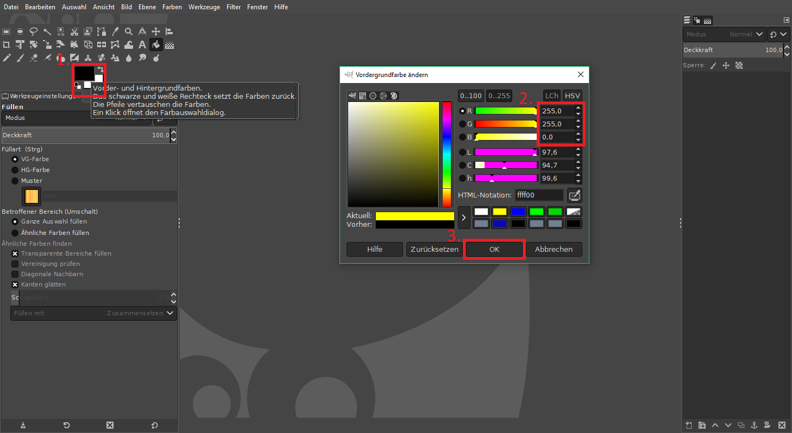

# Stimuli präparieren

## Vorbereitung 

### [Gimp](https://www.gimp.org/) (installieren &) öffnen

### Farbe einstelleen

#### 1. 

####2.

+   R: 255, G: 255, B: 0
+   Die Werte können direkt eingetippt werden, mit **OK** bestätigen.
    +   Diese Einstellung sollte erhalten bleiben, egal wie viele Dateien in in Folge öffnet, ggf. sogar beim Programmneustart.

## Workflow

### Stimulus öffnen

+   Über *Datei* auf *Öffnen...* klicken, und

+   .xfc-Datei des zu bearbeitenden Stimulus' auswählen

### Stimulus präparieren

#### Präparation in 5 Schritten

1.  Ebene ausblenden
2.  Zauberstab auswählen(Tastenkombination: **U**)
3.  blaues Objekt (hier zur Anschauung blau/gelb daragestellt) durch Anklicken markieren
4.  Eimer auswählen (Tastenkombination: **Shift** + **B**)
    +   sicher stellen, dass die Farbe korrekt eingestellt ist
5.  Markierte Fläche durch Anklicken einfärben

### Stimulus exportieren

+   Über *Datei* auf *Exportieren als...* klicken

+   den Dateinamen entsprechend anpassen
    +   **roi-**STIMULUS-ID**.png**
+   *Exportieren* klicken

+   *Exportieren* klicken

