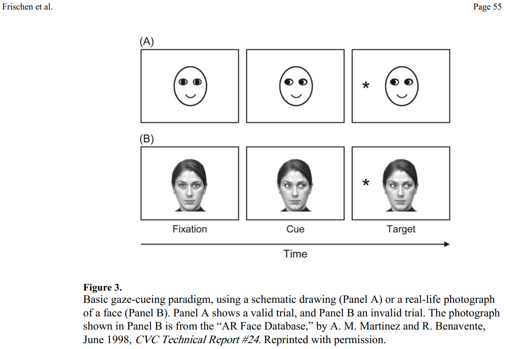

class: inverse, center, middle

```{r setup, include=FALSE}
options(htmltools.dir.version = FALSE)

library(tidyverse)
#library(kableExtra)
library(knitr)

### Sitzungen
source("../dates.R", encoding = "UTF-8")

```

# Heute
 --- 

## Kollaboration

## Lernziele

## Inhalt

## Fahrplan

---
class: inverse, center, middle

## Kollaboration

---

## Kollaboration

+   Mails angekommen?

+   Namen?

+   [Website](grszkth.fr/teaching/ws18/empra) läuft?

--

.center[

`r icon::fa_check(size = 5, color = "green")`

]
---

class: inverse, center, middle

## Lernziele

---

## Lernziele

.center[

  [`r icon::fa_list(size = 3)`](../material/lernziele.md)

]

---

class: inverse, center, middle

## Inhalt

---

## Inhalt

???

+   Zurechtgekommen? Zeitlich? Schwierigkeiten? Leichtigkeiten?

--

[Frischen et al., 2006](http://psycnet.apa.org/buy/2007-09203-007) `r icon::fa_arrow_right()` [Morgen et al. 2018](https://www.mdpi.com/2411-5150/2/1/11/htm) 
--
`r icon::fa_arrow_right()` [Zwickel & Võ, 2010](https://link.springer.com/article/10.3758/PBR.17.2.257) `r icon::fa_arrow_right()` [Risko et al., 2016](http://journals.sagepub.com/doi/abs/10.1177/0963721415617806)

???

+   Was für ein Artikel?
        +   nicht-empirisch
        +   unsystematischer research synthesis: review
        +   Alter?
+   Aufbau Artikel (M)?


--

.pull-left[

### gaze cueing

]

--

???

+   Frage:
    +   Worum geht's? (F)
    +   *joint* attention?
    +   Was ist die Fragestellung? (M)
    +   Abweichung zum klassischen Gaze? (M)
    +   Wie wird's gemessen? (M)
    +   Was kommt raus? (M)
        +   Kennzahlen: Teststatistik, Effektgröße, Unsicherheitsmaß


--

.pull-right[

### ecological validity

]

???

+   Frage:
    +   Was ist das?
    +   Warum?
        +   "These results clearly demonstrate that the real and
implied presence of another person can substantially
alter patterns of gaze in social contexts. [p.72]"
    +   Dual function of gaze?
    +   Sind besprochenen Studien ökologisch valide? (R)
        +   Warum nicht? 
    +   Alles schlecht bisher?
    +   Lösungsideen?
---

## Inhalt

[Frischen et al., 2006](http://psycnet.apa.org/buy/2007-09203-007) `r icon::fa_arrow_right()` [Morgen et al. 2018](https://www.mdpi.com/2411-5150/2/1/11/htm) `r icon::fa_arrow_right()` [Zwickel & Võ, 2010]() `r icon::fa_arrow_right()` [Risko et al., 2016](http://journals.sagepub.com/doi/abs/10.1177/0963721415617806)

.pull-left[

### gaze cueing

[](http://psycnet.apa.org/buy/2007-09203-007)

]

.pull-right[

### ecological validity

.center[
`r icon::fa_question_circle(size = 5)`
]

]

---

## Inhalt

[Frischen et al., 2006](http://psycnet.apa.org/buy/2007-09203-007) `r icon::fa_arrow_right()` [Morgen et al. 2018](https://www.mdpi.com/2411-5150/2/1/11/htm) `r icon::fa_arrow_right()` [Zwickel & Võ, 2010](https://link.springer.com/article/10.3758/PBR.17.2.257) `r icon::fa_arrow_right()` [Risko et al., 2016](http://journals.sagepub.com/doi/abs/10.1177/0963721415617806)

.pull-left[

### gaze cueing

[](http://psycnet.apa.org/buy/2007-09203-007)

]

.pull-right[

### ecological validity

[](https://www.flickr.com/photos/phredkh/42068569012/in/photolist-276spVo-Mr1ymR-2aZtHFA-2aQwRFo-2azccqm-26PWVZ4-UmEWDw-22WjeK5-CVASzm-WGeYvd-e3M7wx-BUAzM7-Z4DKDL-iRDArz-Gy1xHB-22UZ4xV-eXb3DS-KdWNG1-b1XmGH-NpfwNX-ERe9HL-25g6c1c-268qhFS-28i1XiU-JYn8Ke-29jDte3-2aaMCUf-23yYMZn-23NUuL9-HTqDFB-29wFvAb-28M96g6-22SoU9f-MS2HRk-FHru4K-DCPUA2-ZPkpjL-MTFzPr-G1u6JD-Gmeu5F-YWWmV9-27Cy6W9-23onzH2-LE4gqF-23ivU8Q-23Bc74r-28GVApj-Zq4Hyv-cJxAMh-23JNd1z)

]

    

---

class: inverse, center, middle

## Fahrplan

---

## Fahrplan

<font size="-1">`r sitzung_html`</font>

---

## Was nebenbei passiert ist...
### Art des Artikels

--

+   empirisch vs. Review
+   Alter

--

### Aufbau eines empirischen Artikels

--

Titel `r icon::fa_arrow_right()` Abstract `r icon::fa_arrow_right()` Einleitung `r icon::fa_arrow_right()` Methoden `r icon::fa_arrow_right()` Ergebnisse `r icon::fa_arrow_right()` Diskussion (`r icon::fa_plus()` Referenzen)

--
 
+   Inhalt, Aufbau: Abstract, Einleitung, Diskussion

+   Information in den Methoden
    +   Stichprobenbeschreibung, Versuchsablauf, Versuchsdesign, [AVs, UVs](https://de.wikipedia.org/wiki/Einflussgr%C3%B6%C3%9Fe_und_Zielgr%C3%B6%C3%9Fe)

+   Kennzahlen in den Ergebnissen
    +   [Teststatistik](https://de.wikipedia.org/wiki/Teststatistik), [Effektgrößen](https://de.wikipedia.org/wiki/Effektst%C3%A4rke), [Unsicherheitsmaße](https://de.wikipedia.org/wiki/Standardfehler)

---

class: inverse

# Nächste Woche

 ---

+   Wie kann man *gaze cueing* *ecological valid* im Labor testen?

+   [`r icon::fa_hand_point_right()` AsPredicted](https://www.aspredicted.org)

    +   Was ist [*pre-registration*](https://www.apa.org/science/about/psa/2015/08/pre-registration.aspx)?
    
    +   [Oder](https://www.nature.com/articles/s41562-016-0021), [oder](http://blogs.discovermagazine.com/neuroskeptic/2012/04/14/fixing-science-systems-and-politics), [oder](http://www.cogsci.nl/blog/miscellaneous/215-the-pros-and-cons-of-pre-registration-in-fundamental-research) [mit](http://blogs.discovermagazine.com/neuroskeptic/2013/04/25/for-preregistration-in-fundamental-research/), [oder](https://www.theguardian.com/science/head-quarters/2014/may/20/psychology-registration-revolution), [oder](https://www.theguardian.com/science/head-quarters/2017/may/09/from-protoscience-to-proper-science-the-path-ahead-for-reforming-psychology), [oder](http://lmgtfy.com/?s=d&q=preregistration+psychology), ...

---
class: inverse, center, middle

# Noch Fragen?

---

class: inverse, center, middle

# Vielen Dank für Eure Aufmerksamkeit!

## Bis nächsten Montag.

`r icon::fa_smile(size = 5, color = "yellow")`


.footnote[

<font size="-2">Slides created via the R packages [**xaringan**](https://github.com/yihui/xaringan) and [knitr](http://yihui.name/knitr), and [R Markdown](https://rmarkdown.rstudio.com).

<a rel="license" href="http://creativecommons.org/licenses/by-sa/4.0/"></a><br />Dieses Werk ist lizenziert unter einer <a rel="license" href="http://creativecommons.org/licenses/by-sa/4.0/">Creative Commons Namensnennung - Weitergabe unter gleichen Bedingungen 4.0 International Lizenz</a>.</font size>

]

