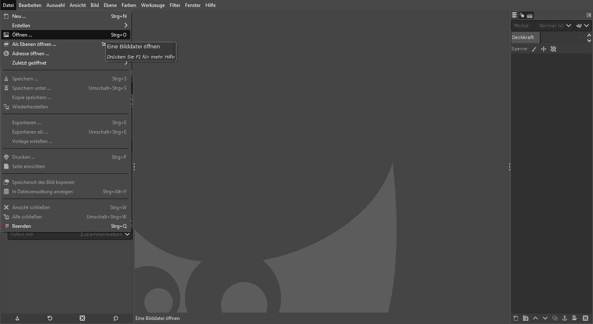
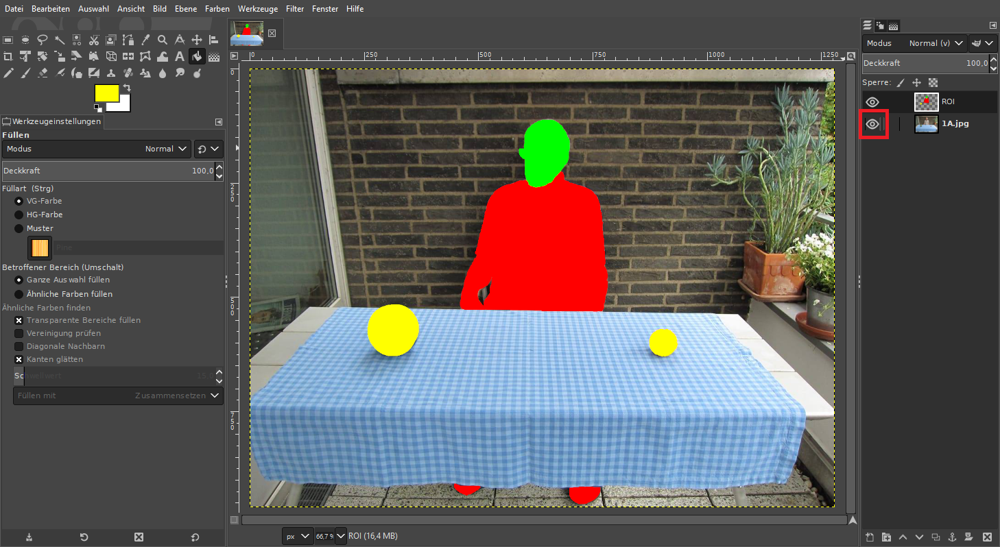
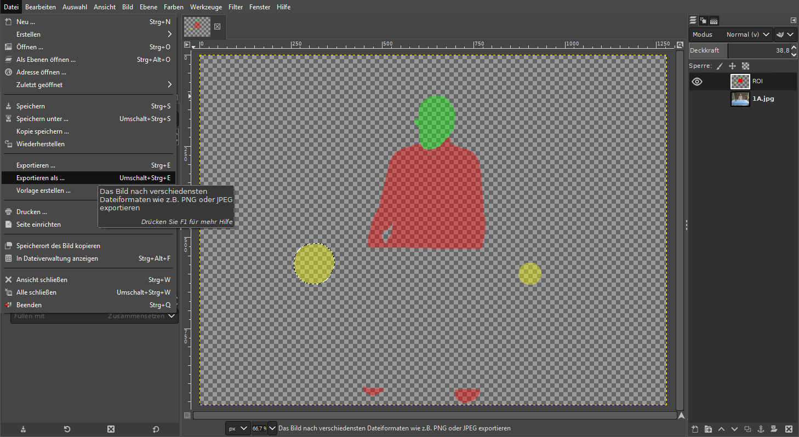
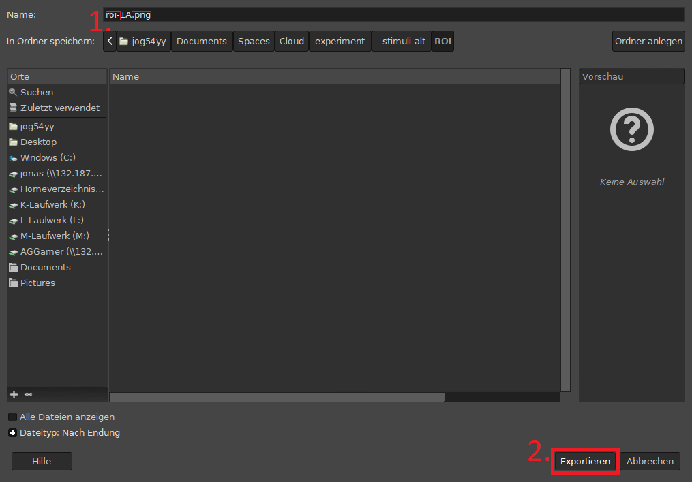

class: inverse, center, middle

```{r setup, include=FALSE}
options(htmltools.dir.version = FALSE)

library(tidyverse)
#library(kableExtra)
library(knitr)

```

# Heute
 --- 

## Präregistrierung

## Stimuli

---
class: inverse, center, middle

## Präregistrierung

---

### Hypothesen

--

#### Gütemerkmale

+   Falsifizierbarkeit
+   Präzisierbarkeit
+   Theorierelevanz
+   Parsimonität
    +   [Occam's Razor](https://de.wikipedia.org/wiki/Ockhams_Rasiermesser)
    > In no case is an animal activity to be interpreted in terms of higher psychological processes, if it can be fairly interpreted in terms of processes which stand lower in the scale of psychological evolution and development.” (Morgan, 1906)


.footnote[

aus: Reiß, S. & Sarris, V. (2012). Experimentelle Psychologie: Von Theorie zur Praxis. Pearson Studium.

]

???

präzisierbarkeit durch weiteren Faktor

---
class: inverse, center, middle

## Stimuli

---

### visuelle Stimuli

### auditive Stimuli (optional)

---

background-image: url(https://www.gimp.org/images/frontpage/wilber-big.png)

### visuelle Stimuli

#### 1.  [Gimp](https://www.gimp.org/) (installieren &) öffnen

---

### visuelle Stimuli

#### 2. .xfc-Datei öffnen


---

### visuelle Stimuli

#### 3. Ebene (mit Foto) ausblenden


---

### visuelle Stimuli

#### 4. Stimulus bearbeiten


---

### visuelle Stimuli

#### 5. Exportieren



---

### visuelle Stimuli

#### Exportieren

.pull-left[

##### Dateiname  



`r icon::fa_exclamation_triangle(color = "red")` **roi-**STIMULUS-ID**.png**

]

.pull-right[

##### Exportieren


]

---

### auditive Stimuli (optional)

#### Auftreiben

+   kurze Dauer (2-5 Sekunden)
+   hochwertige Qualität
+   zur Szene passend

---
class: inverse

# Nächste Woche

 ---
 
+   visuelle Stimuli präperieren
+   passende auditive Stimuli auftreiben (optional)

---

class: inverse, center, middle

# Noch Fragen?

---

class: inverse, center, middle

# Vielen Dank für Eure Aufmerksamkeit!

## Bis nächsten Montag.

`r icon::fa_smile(size = 5, color = "yellow")`


.footnote[

<font size="-2">Slides created via the R packages [**xaringan**](https://github.com/yihui/xaringan) and [knitr](http://yihui.name/knitr), and [R Markdown](https://rmarkdown.rstudio.com).

<a rel="license" href="http://creativecommons.org/licenses/by-sa/4.0/"></a><br />Dieses Werk ist lizenziert unter einer <a rel="license" href="http://creativecommons.org/licenses/by-sa/4.0/">Creative Commons Namensnennung - Weitergabe unter gleichen Bedingungen 4.0 International Lizenz</a>.</font size>

]