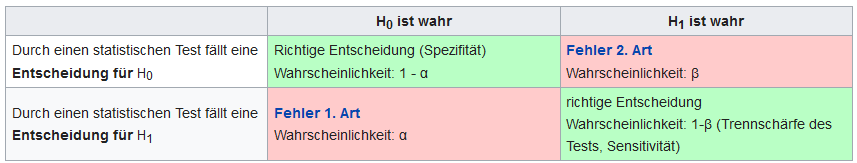

class: inverse, center, middle

```{r setup, include=FALSE}
options(htmltools.dir.version = FALSE)

library(tidyverse)
#library(kableExtra)
library(knitr)

```

# Heute
 --- 

##  Präregistrierung
##  Stimuli
##  Ausblick

---

class: center, middle, inverse

##  Präregistrierung

---

## Preregistration

### Stichprobengröße bestimmen

#### Was ist [Power](https://de.wikipedia.org/wiki/Trennsch%C3%A4rfe_eines_Tests)?

+    ist die Wahrscheinlichkeit eines statistischen Tests die abzulehnende Nullhypothese („Es gibt keinen Unterschied“) korrekt zurückzuweisen, wenn die Alternativhypothese („Es gibt einen Unterschied“) wahr ist.

--



.center[ http://rpsychologist.com/d3/NHST/ ]

---

## Preregistration

##### Power Simulation

+   *wahre* Effekte angeben

--

+   5000 ANOVAS rechnen
--

+   p-Werte zählen

--

+   Stichprobengröße anschauen

---

background-image: url(../material/power/power-haupteffekt.png)
background-size: 60%

## Preregistration

##### Power Simulation

---

background-image: url(../material/power/power-ohne_haupteffekt.png)
background-size: 80%

## Preregistration

##### Power Simulation

---

## Preregistration

#### Power Simulation

+   n = 75

<iframe src="https://giphy.com/embed/JQQwgVUMDIyAM" width="480" height="360" frameBorder="0" class="giphy-embed" allowFullScreen></iframe>

---
class: inverse, center, middle

## Stimuli

---

## Stimuli

### visuell

--

#### Feedback?

--

#### Auswahl

+   Qualität
    +   gaze cue
    +   ROI
    
    `r icon::fa_arrow_right()` komplette Sets Einzelbilder?

+   Nachbearbeitung
    +   ROIs nachzeichnen?

---

## Stimuli

### auditive Stimuli


.center[

`r icon::fa_frown(size = 5, color = "blue")`

]

---
class: inverse

# Nächste Woche

 ---
 
+   Pilotieren
+   Stimuli bearbeiten
+   Präreg abschließen (Jonas)

---

class: inverse, center, middle

# Noch Fragen?

---

class: inverse, center, middle

# Vielen Dank für Eure Aufmerksamkeit!

## Bis nächsten Montag.

`r icon::fa_smile(size = 5, color = "yellow")`


.footnote[

<font size="-2">Slides created via the R packages [**xaringan**](https://github.com/yihui/xaringan) and [knitr](http://yihui.name/knitr), and [R Markdown](https://rmarkdown.rstudio.com).

<a rel="license" href="http://creativecommons.org/licenses/by-sa/4.0/"></a><br />Dieses Werk ist lizenziert unter einer <a rel="license" href="http://creativecommons.org/licenses/by-sa/4.0/">Creative Commons Namensnennung - Weitergabe unter gleichen Bedingungen 4.0 International Lizenz</a>.</font size>

]